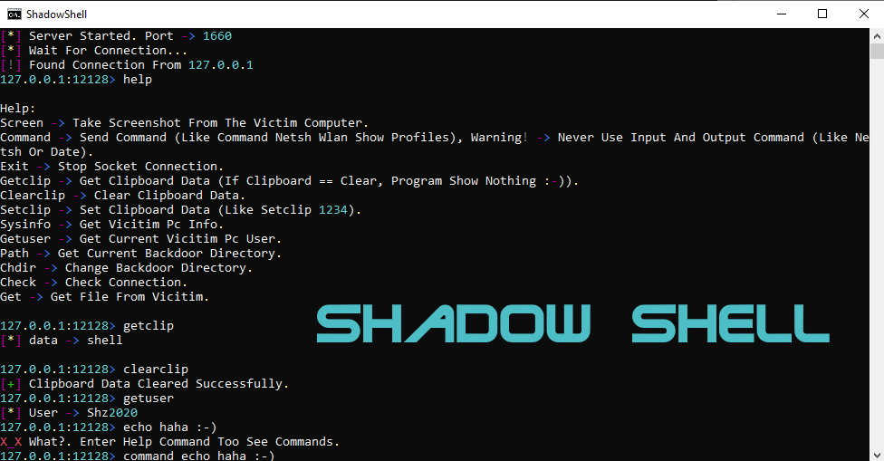

# ShadowShell

Reverse TCP App with python By aminXD. Support:
## Server
* Windows (Tested), Linux

## Client
* Windows (tested)
## Features
* Can Be **EXE** File.
* Can Take Screenshot, Get Clipboard, Set Clipboard, Others Can`t Sniff Packets (Cause Coded With bz2), Get File From Vicitim, Get Vicitim System Info, Send Command.
* Have Color Art.
* Compress Data, Cause Less Data = Less Time To Send = Less Data Usage.
---
> Important note: Never Use Input Command Like **netsh** Just Use Output Command Like **netsh wlan show profiles**.
